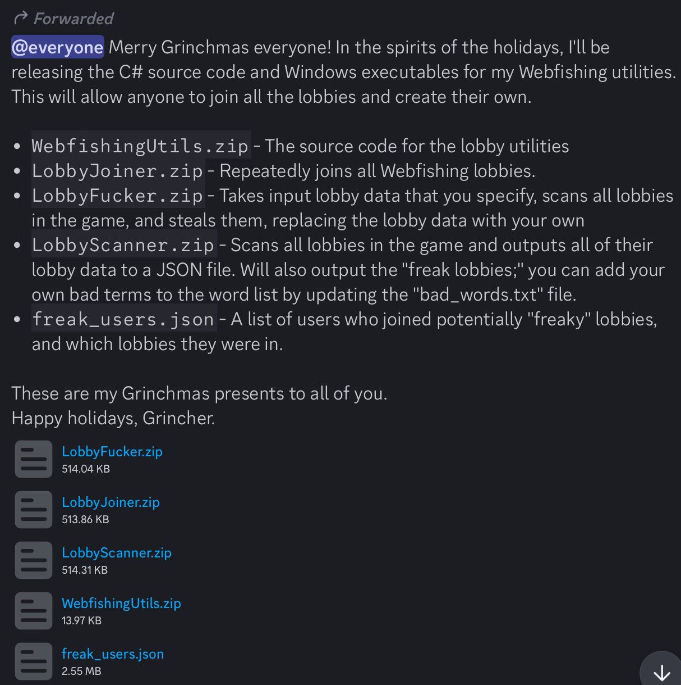
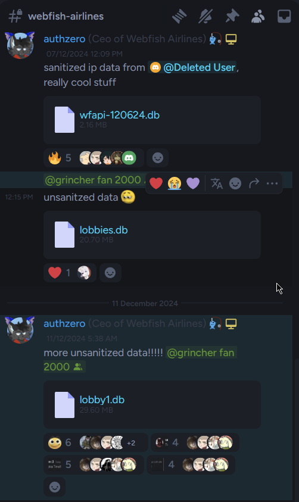

# Grinhcer has released his tools
Grincher has gone out of his way to release his tools to the public via his discord.

While many who we look up to in this community wish to keep this quiet. This has stepped over moral and legal lines. Releasing not only tools for fucking over Webfishing lobbies but even going as far as to stand by and watch databases filled with PIID be released in his discord.

# THIS IS ILLEGAL, IMMORAL AND ENTIRELY OVERSTEPPING
Authzero is a member of his staff. Grincher continues to allow this and even PROMOTES what is essentially a wide spread dozzing and abusive campaign. These people believe my list of SteamIDs is somehow worse than the active crusade they go on against our community.

# What do we do?
Keep reporting people, adding them to this list and hoping that something happens legally to these people. Report their [website](https://webfish-airlines.com) to Cloudflare, report their accounts to steam, report [Authzero's Github](https://github.com/Auth-Xero/WebfishAirlines-ATC) to Github, report their accounts to discord. Whatever we can do, if we do it together and enough. We can remove these people from where they are and hopefully bring back the community to a state of mind where you don't log into any lobby fearing "will my IP be spread in a discord?".
